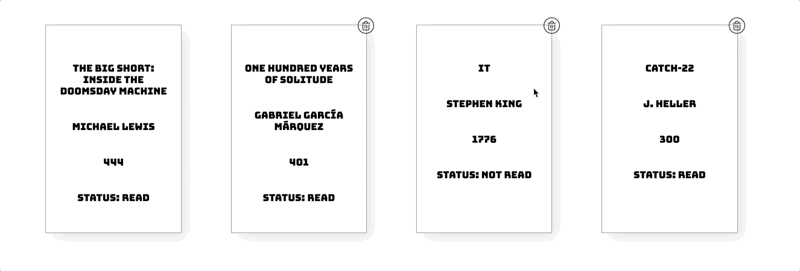

# Digital Library
__[OPEN THE PAGE](https://1063551.github.io/Digital-Library/)__

A Digital Library website app to store your favourite books with a Realtime sync with a Database.
This was made using HTML5, CSS, Vanilla Javascript and a Firebase Database.

You can leave a ⭐️ to motivate me to keep doing more fun things!

## 🤓 Add a new book
The Web App includes a button that let's you add the book you desire. When added, it will get added to the Database, thus rendered on screen.

## 😈 Delete ANY book
Each book includes a Trash Icon to delete the book from the Web App, as well as from the Database, so you can delete other people's books.

